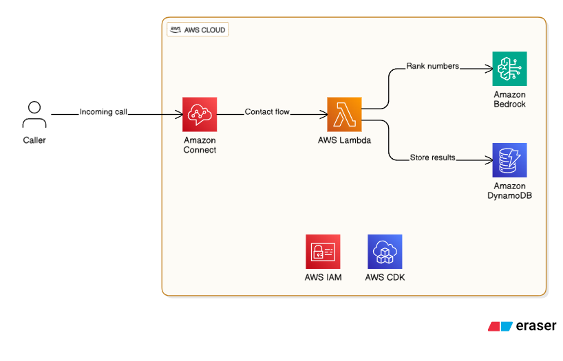

# Connect Vanity Numbers

This AWS CDK project creates an Amazon Connect vanity number lookup system that generates creative vanity phone numbers from caller's phone numbers in real-time.

## Architecture



The solution includes:
- **Amazon Connect Contact Flow** - Handles incoming calls and orchestrates the vanity number generation
- **AWS Lambda Function** - Python function that generates vanity number candidates and ranks them using AI
- **Amazon Bedrock** - AI service for ranking and formatting vanity numbers
- **DynamoDB Table** - Stores vanity number results for each caller
- **IAM Roles & Policies** - Secure access between services


## Prerequisites

- AWS CLI configured with appropriate permissions
- Node.js and npm installed
- AWS CDK v2 installed (`npm install -g aws-cdk`)
- SAM CLI installed (for local debugging)
- Docker installed
- An existing Amazon Connect instance
- Bedrock model access
    - Ensure the specified model is available in your AWS account and region


## Configuration Parameters

The stack accepts the following parameters that can be configured during deployment:

### ConnectInstanceArn (Required)
- **Description**: The ARN of your Amazon Connect instance
- **Type**: String
- **Default**: Empty (must be provided)
- **Example**: `arn:aws:connect:us-east-1:123456789012:instance/12345678-1234-1234-1234-123456789012`

### BedrockModelId (Optional)
- **Description**: The Bedrock model ID to use for vanity number generation and ranking
- **Type**: String
- **Default**: `anthropic.claude-3-5-sonnet-20240620-v1:0`
- **Supported Models**: Any Anthropic Claude model available in Amazon Bedrock


## Deployment

### 1. Install Dependencies
```bash
npm install
```

### 2. Build the Project
```bash
npm run build
```

### 3. Deploy with Parameters
```bash
# Deploy with required Connect instance ARN
npx cdk deploy --parameters ConnectInstanceArn=arn:aws:connect:us-east-1:123456789012:instance/your-instance-id

# Deploy with custom Bedrock model
npx cdk deploy --parameters ConnectInstanceArn=arn:aws:connect:us-east-1:123456789012:instance/your-instance-id --parameters BedrockModelId=anthropic.claude-3-haiku-20240307-v1:0
```

### 4. Post-Deployment Setup
1. Navigate to your Amazon Connect instance
2. Go to Contact Flows and find "Vanity Number Lookup Flow"
3. Assign a phone number to this contact flow
4. Test by calling the assigned number

## How It Works

-  **Candidate Generation**: Lambda generates all possible letter combinations from the phone number digits
- **Word Validation**: Candidates are validated against the NLTK English word corpus
- **AI Ranking**: Amazon Bedrock ranks candidates based on memorability, pronunciation, and appropriateness. Results are formatted for better text-to-speech delivery.

## Local Development

### Testing the Lambda Function
Use the SAM CLI for local Lambda function testing, providing a Connect Contact Flow event.

```bash
sam local invoke -t ./cdk.out/ConnectVanityNumbersStack.template.json -e ./vanity-number-lambda/event.json --profile personal     
```

### Useful CDK Commands

* `npm run build`   - Compile TypeScript to JavaScript
* `npm run watch`   - Watch for changes and compile
* `npm run test`    - Perform the Jest unit tests
* `npx cdk deploy`  - Deploy this stack to your default AWS account/region
* `npx cdk diff`    - Compare deployed stack with current state
* `npx cdk synth`   - Emits the synthesized CloudFormation template
* `npx cdk destroy` - Delete the stack and all resources
